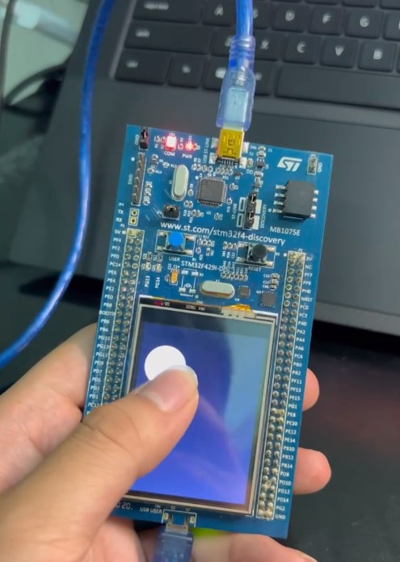

# ĐỒ ÁN HỆ NHÚNG (IT4210): TOUCHPAD USB HID TRÊN STM32F429I-DISC1

<p align="center">
  
</p>

*Hình 1. Tổng quan sản phẩm touchpad USB HID sử dụng màn hình cảm ứng trên kit
STM32F429I-DISC1 và kết nối với máy tính.*

## 1. Giới thiệu

Dự án xây dựng một **bàn di chuột (touchpad) USB HID** từ kit
**STM32F429I-DISC1**. Người dùng thao tác trên màn hình cảm ứng của kit để
điều khiển con trỏ và thực hiện click chuột trên máy tính. Giao diện được phát
triển bằng **TouchGFX**, các tác vụ chạy trên **FreeRTOS**, còn dữ liệu chuột
được truyền qua cổng **USB OTG HS ở chế độ Device/Full Speed**.

Máy tính nhận thiết bị như một chuột USB HID tiêu chuẩn nên không cần cài
driver riêng.

### Chức năng chính

- Kéo ngón tay trên màn hình để di chuyển con trỏ theo độ dịch chuyển tương đối.
- Chạm ngắn rồi thả để thực hiện một lần click chuột trái.
- Nhấn giữ rồi kéo để thực hiện thao tác giữ chuột trái (drag-and-drop).
- Hiển thị vòng tròn tại vị trí chạm và tạo hiệu ứng co dần khi thả tay.
- Tích lũy chuyển động trong khoảng `-1024..1024` và chia thành nhiều HID
  report; độ dịch chuyển của mỗi report được giới hạn trong `-127..127`.
- Kiểm tra trạng thái USB trước khi gửi để không ghi đè report đang được truyền.

---

## 2. Phần cứng và phần mềm

### 2.1. Phần cứng

| Thành phần | Vai trò |
|---|---|
| STM32F429I-DISC1 | Kit phát triển chính, sử dụng MCU STM32F429ZITx (ARM Cortex-M4F) |
| LCD-TFT 2,4 inch, 240 × 320 | Hiển thị giao diện TouchGFX ở chế độ dọc, RGB565 |
| STMPE811 | Bộ điều khiển cảm ứng, giao tiếp với MCU qua I2C3 |
| ILI9341 | Bộ điều khiển LCD; phần lệnh cấu hình được truyền qua SPI5 |
| SDRAM ngoài | Chứa framebuffer và dữ liệu đồ họa |
| USB OTG HS | Hoạt động ở chế độ USB Device với PHY Full Speed tích hợp, truyền HID report qua PB14/PB15 |
| ST-LINK/V2-B | Nạp chương trình và gỡ lỗi |

Cần hai kết nối USB khi vừa gỡ lỗi vừa sử dụng sản phẩm:

1. Cổng ST-LINK để cấp nguồn, nạp và debug firmware.
2. Cổng USB USER/OTG nối với máy tính để máy tính nhận chuột HID.

### 2.2. Phần mềm và thư viện

- STM32CubeIDE và STM32CubeMX.
- STM32Cube firmware package **STM32CubeF4 v1.28.3**.
- TouchGFX Designer/Framework **v4.26.1**.
- FreeRTOS với lớp CMSIS-RTOS v2.
- STM32 HAL, CMSIS và STM32 USB Device Library.
- ARM GNU Toolchain (`arm-none-eabi-gcc/g++`) nếu build bằng Makefile.
- STM32CubeProgrammer nếu nạp trực tiếp từ TouchGFX Designer hoặc Makefile.

---

## 3. Kiến trúc hệ thống

Luồng xử lý tổng quát:

```text
Ngón tay
   │
   ▼
STMPE811 ──I2C3──> STM32TouchController
                         │ tọa độ chạm
                         ▼
                TouchGFX / Screen1View
                  │              │
                  │              └──> Vẽ vòng tròn phản hồi trên LCD
                  ▼
       Tính dx, dy và trạng thái nút
                  │
                  ▼
          USB_Mouse_TrySend()
                  │
                  ▼
       USB HID report 4 byte ──> Máy tính
```

Firmware sử dụng hai task FreeRTOS có cùng mức ưu tiên:

| Task | Stack cấu hình | Nhiệm vụ |
|---|---:|---|
| `defaultTask` | 128 word | Khởi tạo USB Device, sau đó chờ định kỳ |
| `GUI_Task` | 8192 word | Chạy vòng lặp TouchGFX, lấy mẫu cảm ứng, xử lý giao diện và gửi lệnh chuột |

USB được khởi tạo trong `StartDefaultTask()`. Vì vậy
`USB_Mouse_TrySend()` luôn kiểm tra thiết bị đã ở trạng thái
`USBD_STATE_CONFIGURED` trước khi truyền dữ liệu.

---

## 4. Tổ chức mã nguồn

```text
STM32F429I-DISC1_HID_MOUSE/
├── Core/
│   ├── Inc/                         # Header, cấu hình HAL và FreeRTOS
│   └── Src/
│       ├── main.c                   # Clock, ngoại vi, SDRAM và các task
│       └── stm32f4xx_it.c           # Trình phục vụ ngắt USB, LTDC, DMA2D...
├── Drivers/
│   ├── CMSIS/
│   ├── STM32F4xx_HAL_Driver/
│   └── BSP/Components/              # Driver ILI9341 và STMPE811
├── Middlewares/
│   ├── ST/
│   │   ├── STM32_USB_Device_Library/
│   │   └── touchgfx/
│   └── Third_Party/FreeRTOS/
├── TouchGFX/
│   ├── gui/src/screen1_screen/
│   │   └── Screen1View.cpp          # Logic touchpad và hiệu ứng
│   ├── target/
│   │   └── STM32TouchController.cpp # Đọc, lọc và hiệu chỉnh tọa độ chạm
│   └── TouchMouse.touchgfx           # Thiết kế giao diện TouchGFX
├── USB_DEVICE/
│   ├── App/usb_device.c             # Khởi tạo USB và đóng gói HID report
│   └── Target/usbd_conf.c            # Liên kết USB Device Library với HAL PCD
├── gcc/Makefile                      # Build bằng ARM GNU Toolchain
├── STM32CubeIDE/                     # Project dành cho STM32CubeIDE
└── STM32F429I_DISCO_REV_D01.ioc      # Cấu hình STM32CubeMX
```

---

## 5. Phân tích chức năng

### 5.1. Khởi tạo vi điều khiển và ngoại vi

Trong `main.c`, hệ thống sử dụng HSE 8 MHz và PLL với các hệ số:

- `PLLM = 8`, `PLLN = 336`, `PLLP = 2`: tạo SYSCLK 168 MHz.
- `PLLQ = 7`: tạo clock 48 MHz cho USB.
- AHB chạy 168 MHz, APB1 chạy 42 MHz và APB2 chạy 84 MHz.

Các ngoại vi chính được khởi tạo lần lượt gồm GPIO, CRC, I2C3, SPI5, FMC/SDRAM,
LTDC, DMA2D và TouchGFX. Sau đó kernel FreeRTOS tạo `defaultTask` và
`GUI_Task`.

### 5.2. Đọc và hiệu chỉnh cảm ứng

`STM32TouchController::sampleTouch()` được TouchGFX gọi theo từng tick. Hàm
đọc trạng thái từ STMPE811 và chỉ trả về `true` khi phát hiện có chạm.

Trong `BSP_TS_GetState()`:

- Tọa độ thô được hiệu chỉnh theo phiên bản phần cứng của kit.
- Biến `isRevD` được xác định lúc khởi tạo SPI5 để xử lý đúng kit revision D
  trở lên.
- Tọa độ được giới hạn trong vùng màn hình 240 × 320.
- Bộ lọc chỉ cập nhật điểm chạm khi tổng thay đổi theo hai trục lớn hơn 5,
  giúp giảm rung con trỏ do nhiễu cảm ứng.

### 5.3. Di chuyển con trỏ

Khi TouchGFX phát sinh `DragEvent`, `handleDragEvent()` lấy:

```cpp
deltaX = newX - oldX;
deltaY = newY - oldY;
```

Hai giá trị này được đưa vào `queueMouseMovement()`. Dự án dùng chuyển động
tương đối, vì vậy con trỏ máy tính di chuyển theo quãng đường ngón tay thay vì
ánh xạ tuyệt đối từ màn hình 240 × 320 sang một độ phân giải máy tính cố định.
Cách làm này không phụ thuộc độ phân giải màn hình của máy tính.

Phần dịch chuyển đang chờ được giới hạn trong `-1024..1024`. Khi gửi,
`serviceUsbMouse()` lấy tối đa `±127` cho mỗi trục; phần còn lại được giữ lại
cho các tick tiếp theo. Cơ chế này cho phép truyền tuần tự chuyển động đã tích
lũy mà vẫn bảo đảm từng HID report đúng miền giá trị của trường `int8_t`. Nếu
tổng chuyển động chờ vượt quá `±1024`, giá trị sẽ được giới hạn tại ngưỡng này.

### 5.4. Nhận dạng thao tác click và kéo-thả

Các ngưỡng được định nghĩa trong `Screen1View.cpp`:

| Hằng số | Giá trị | Ý nghĩa |
|---|---:|---|
| `MIN_TAP_TICKS` | 3 | Thời gian chạm tối thiểu để nhận là tap |
| `MAX_TAP_TICKS` | 18 | Thời gian chạm tối đa để nhận là tap |
| `HOLD_TICKS` | 30 | Thời gian giữ để nhấn giữ nút trái |
| `TAP_MOVEMENT_LIMIT` | 4 | Tổng dịch chuyển tối đa vẫn được xem là chạm tại chỗ |
| `POINTER_GAIN` | 1 | Hệ số nhân độ dịch chuyển con trỏ |

Các giá trị thời gian trên được tính theo tick của TouchGFX, không phải mili
giây cố định.

- **Tap:** thả tay trong khoảng 3–18 tick và tổng quãng đường không quá 4 pixel.
  Firmware gửi report nhấn nút trái, sau đó tự gửi report nhả nút ở tick kế tiếp.
- **Giữ:** giữ ít nhất 30 tick và không di chuyển quá 4 pixel để đặt nút trái
  ở trạng thái nhấn.
- **Kéo-thả:** sau khi trạng thái giữ được kích hoạt, người dùng kéo ngón tay
  để di chuyển con trỏ trong khi nút trái vẫn được nhấn; thả tay sẽ gửi trạng
  thái nhả nút.

### 5.5. Hiệu ứng phản hồi

Khi bắt đầu chạm, `circle1` được đặt tại vị trí ngón tay với bán kính 40 pixel.
Vòng tròn đi theo ngón tay trong lúc kéo. Sau khi thả:

- `releaseAnimation` được bật.
- Bán kính giảm 2 pixel sau mỗi tick.
- Vòng tròn được ẩn khi bán kính về gần 0.

Các lần gọi `invalidate()` trước và sau khi thay đổi vị trí/kích thước yêu cầu
TouchGFX vẽ lại cả vùng cũ lẫn vùng mới, tránh để lại vệt trên màn hình.

### 5.6. Giao tiếp USB HID

`USB_Mouse_TrySend()` tạo report chuột gồm 4 byte:

| Byte | Nội dung |
|---:|---|
| 0 | Các bit trạng thái nút chuột; bit 0 là nút trái |
| 1 | Dịch chuyển X tương đối, kiểu `int8_t` |
| 2 | Dịch chuyển Y tương đối, kiểu `int8_t` |
| 3 | Con lăn; dự án hiện gửi giá trị 0 |

Trước khi gọi `USBD_HID_SendReport()`, hàm kiểm tra:

1. USB đã được máy tính cấu hình.
2. Con trỏ dữ liệu lớp HID hợp lệ.
3. Endpoint HID đang ở trạng thái rảnh.

Nếu USB đang bận, hàm trả về 0. `serviceUsbMouse()` không xóa chuyển động đang
chờ và sẽ thử lại ở tick sau. Đây là cơ chế gửi không chặn, tránh dùng
`HAL_Delay()` trong task giao diện.

---

## 6. Đặc tả các hàm chính

### `Screen1View::handleClickEvent(const touchgfx::ClickEvent& evt)`

Nhận sự kiện nhấn/thả từ TouchGFX. Khi nhấn, hàm lưu tọa độ ban đầu, đặt lại bộ
đếm và hiển thị vòng tròn. Khi thả, hàm quyết định gửi click, nhả thao tác kéo
hoặc chỉ chạy hiệu ứng tùy thời gian và quãng đường đã chạm.

### `Screen1View::handleDragEvent(const touchgfx::DragEvent& evt)`

Tính độ dịch chuyển giữa hai mẫu cảm ứng liên tiếp, cộng vào hàng đợi chuyển
động và cập nhật vị trí vòng tròn.

### `Screen1View::handleTickEvent()`

Cập nhật thời gian nhấn, nhận dạng nhấn giữ, phục vụ hàng đợi USB và chạy hiệu
ứng thu nhỏ vòng tròn.

### `Screen1View::queueMouseMovement(int16_t deltaX, int16_t deltaY)`

Nhân độ dịch chuyển với `POINTER_GAIN`, cộng dồn phần chưa gửi và chống tràn
bằng cách giới hạn từng trục trong khoảng `-1024..1024`.

### `Screen1View::serviceUsbMouse()`

Chuyển dữ liệu đang chờ thành report hợp lệ, thử gửi qua USB và chỉ trừ phần
dịch chuyển sau khi gửi thành công. Hàm cũng tạo report nhả nút sau một lần
click.

### `USB_Mouse_TrySend(uint8_t buttons, int8_t deltaX, int8_t deltaY)`

Kiểm tra trạng thái USB/HID, đóng gói report 4 byte và gọi
`USBD_HID_SendReport()`. Giá trị trả về là 1 khi report được nhận để truyền,
hoặc 0 khi USB chưa sẵn sàng/đang bận.

### `STM32TouchController::sampleTouch(int32_t& x, int32_t& y)`

Đọc bộ điều khiển STMPE811, trả tọa độ đã hiệu chỉnh cho TouchGFX khi có chạm.

---

## 7. Hướng dẫn build và chạy

### 7.1. Build bằng STM32CubeIDE

1. Mở STM32CubeIDE.
2. Chọn **File → Import → Existing Projects into Workspace**.
3. Chọn thư mục `STM32CubeIDE` của dự án.
4. Build cấu hình Debug hoặc Release.
5. Kết nối cổng ST-LINK của kit và chọn **Run** hoặc **Debug** để nạp firmware.

### 7.2. Build bằng TouchGFX Designer

1. Mở `TouchGFX/TouchMouse.touchgfx` bằng TouchGFX Designer 4.26.1.
2. Chọn **Generate Code** nếu vừa thay đổi giao diện.
3. Chọn **Run Target** để build và nạp bằng cấu hình target có sẵn.

STM32CubeProgrammer phải được cài đặt và nằm trong đường dẫn công cụ của
TouchGFX.

### 7.3. Build bằng Makefile

Tại thư mục gốc của dự án:

```sh
make -f gcc/Makefile -j8
```

Để build và nạp:

```sh
make -f gcc/Makefile flash
```

Cách này yêu cầu ARM GNU Toolchain, GNU Make và STM32CubeProgrammer đã được
cấu hình trong môi trường.

### 7.4. Sử dụng

1. Nạp firmware qua ST-LINK.
2. Nối cổng USB USER/OTG của kit với máy tính.
3. Chờ hệ điều hành nhận thiết bị **STM32 Human interface**.
4. Kéo trên màn hình cảm ứng để di chuột.
5. Chạm ngắn để click trái.
6. Nhấn giữ tại chỗ, sau đó kéo và thả để thực hiện drag-and-drop.

---

## 8. Kiểm thử đề xuất

| Trường hợp | Kết quả mong đợi |
|---|---|
| Cắm USB sau khi firmware đã chạy | Máy tính nhận một chuột HID, không cần driver riêng |
| Kéo chậm theo bốn hướng | Con trỏ di chuyển đúng hướng và tương đối mượt |
| Kéo nhanh/quãng đường lớn | Chuyển động được gửi qua nhiều report, không vượt quá ±127 mỗi report |
| Chạm ngắn tại chỗ | Phát sinh đúng một click trái |
| Giữ tại chỗ rồi kéo | Đối tượng trên máy tính được kéo theo con trỏ |
| Thả sau thao tác giữ | Nút trái được nhả |
| Chạm khi chưa nối USB | Giao diện vẫn hoạt động, firmware không bị treo |
| Nhấn/thả và kéo vòng tròn | Không còn vệt đồ họa tại vị trí cũ |

---

## 9. Hạn chế và hướng phát triển

- Hiện chỉ sử dụng nút chuột trái; chưa có click phải, click giữa và cuộn.
- `POINTER_GAIN` đang cố định bằng 1, chưa có giao diện chỉnh độ nhạy.
- Các ngưỡng tap/hold tính theo tick nên thay đổi tần số tick có thể làm thay
  đổi cảm giác thao tác.
- Hàng đợi chuyển động chỉ lưu tổng theo hai trục, chưa phải queue nhiều sự kiện.
- Có thể bổ sung double-click, cuộn hai ngón, tăng tốc con trỏ và hiệu chuẩn cảm
  ứng trong giao diện.

---

## 10. Ghi chú kỹ thuật

- Độ phân giải giao diện thực tế của dự án là **240 × 320, RGB565, portrait**.
- USB dùng peripheral **USB_OTG_HS** nhưng được cấu hình
  `Device_Only_FS` với PHY Full Speed tích hợp.
- Các chân đo hiệu năng TouchGFX đã được dành sẵn:
  `VSYNC_FREQ` (PE2), `RENDER_TIME` (PE3), `FRAME_RATE` (PE4) và
  `MCU_ACTIVE` (PE5).
- Khi chỉnh giao diện trong TouchGFX Designer, nên đặt logic người dùng trong
  `TouchGFX/gui/` và tránh sửa trực tiếp mã generated để không bị ghi đè.
- Khi tạo lại code từ file `.ioc`, cần kiểm tra để các vùng `USER CODE` liên
  quan đến USB HID, khởi tạo SDRAM/LCD và nhận diện revision của kit vẫn được
  giữ nguyên.

---

## 11. Video demo

Video nên minh họa lần lượt các thao tác:

1. Kết nối kit với máy tính và máy tính nhận chuột HID.
2. Kéo ngón tay để di chuyển con trỏ.
3. Chạm ngắn để click chuột trái.
4. Nhấn giữ rồi kéo để thực hiện drag-and-drop.
5. Hiệu ứng vòng tròn trên màn hình khi chạm và thả tay.

Nhấn vào hình bên dưới để xem video demo trên YouTube:

[](https://youtube.com/shorts/VjN5zoR5IaE?feature=share)

**Liên kết video:** [Touchpad USB HID trên STM32F429I-DISC1 – YouTube Shorts](https://youtube.com/shorts/VjN5zoR5IaE?feature=share)

---

## 12. Nhóm thực hiện

| STT | Họ và tên | MSSV | Phân công |
|---:|---|---:|---|
| 1 | Chu Đình Sơn | 20215636 | Xây dựng logic touchpad (nhận dạng tap, hold, drag-and-drop; tính chuyển động tương đối); tích hợp và gửi HID report qua USB |
| 2 | Ngô Quang Vinh | 20215666 | Cấu hình clock, khởi tạo các ngoại vi (I2C, SPI, SDRAM, LTDC, DMA2D); viết glue code kết nối HAL với driver LCD và cảm ứng; phát hiện phiên bản phần cứng kit; **viết báo cáo** |
| 3 | Nguyễn Đức Minh | 20225885 | Thiết kế giao diện TouchGFX; lập trình driver đọc và hiệu chỉnh tọa độ cảm ứng STMPE811; thực hiện kiểm thử |


## 13. Tài liệu trong dự án

- `STM32F429I_DISCO_REV_D01.ioc`: cấu hình clock, pin, ngoại vi và middleware.
- `TouchGFX/TouchMouse.touchgfx`: cấu hình màn hình và các thành phần đồ họa.
- `Core/Src/main.c`: khởi tạo hệ thống, SDRAM, LCD và FreeRTOS.
- `TouchGFX/gui/src/screen1_screen/Screen1View.cpp`: thuật toán touchpad.
- `TouchGFX/target/STM32TouchController.cpp`: driver và hiệu chỉnh cảm ứng.
- `USB_DEVICE/App/usb_device.c`: khởi tạo và gửi report USB HID.
- `Middlewares/ST/STM32_USB_Device_Library/Class/HID/`: descriptor và lớp HID.
